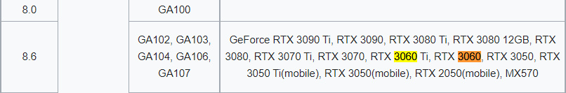
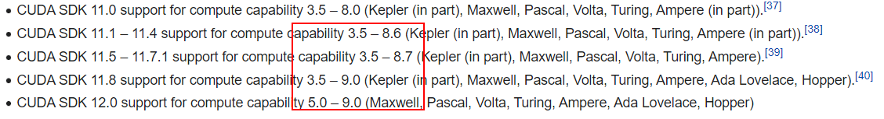
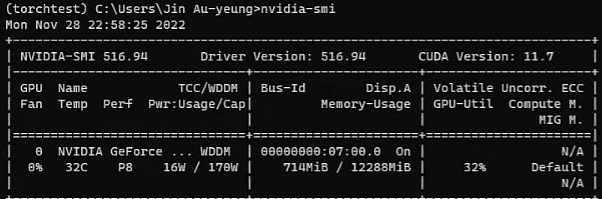

## Pytorch Learning

### Install

从上述图种我们可以知道我们的GPU硬件、显卡驱动、Cuda之间的关系。
我们需要Cuda来告诉驱动显卡，固我们的Cuda版本一定要小于等于我们的驱动版本，否则会无法驱动我们的GPU硬件。

所以我们的安装流程就可以简化为：
1. 确定显卡型号 (NVIDIA GeForce RTX 3060)
2. 确定[显卡算力](https://en.wikipedia.org/wiki/CUDA)  (8.6)
3. 确定CUDA Runtime Version (Cuda 11.1-12.0 Support)

4. 我们看自己的驱动 CUDA Driver Version – 11.7

结合第一张关系图我们的关系就是

GPU Device Version NVIDIA GTX3060 

CUDA Driver Version is 11.7

CUDA Runtime Version restrict <= 11.7

Conda安装教程这里省略，直接进入到Pytorch安装。在上一步创建的虚拟环境中安装PyTorch(安装PyTorch，需要安装pytorch, torchvision, 
torchaudio三个包）
- 从官网（https://pytorch.org/）
  - 采用命令行下载
  - > conda install pytorch torchvision torchaudio pytorch-cuda=11.7 -c pytorch -c nvidia
- 添加镜像源
• conda install pytorch torchvision torchaudio –c 镜像地址

>镜像名 镜像地址 – pytorch, torchvision, torchaudio
清华镜像 https://mirrors.tuna.tsinghua.edu.cn/anaconda/cloud/pytorch/win-64/
北京外国语大学镜像 https://mirrors.bfsu.edu.cn/anaconda/cloud/pytorch/win-64/
阿里巴巴镜像 http://mirrors.aliyun.com/anaconda/cloud/pytorch/win-64/
南京大学镜像 https://mirror.nju.edu.cn/pub/anaconda/cloud/pytorch/win-64/

• Conda install cudatoolkit=版本 –c 镜像地址(11.3版本及以下可以换源，大于采用官方pytorch)

>镜像名 用于创建环境镜像地址 - cudatoolkit
清华镜像 https://mirrors.tuna.tsinghua.edu.cn/anaconda/pkgs/main
北京外国语大学镜像 https://mirrors.bfsu.edu.cn/anaconda/pkgs/main
阿里巴巴镜像 http://mirrors.aliyun.com/anaconda/pkgs/main

检查是否安装成功
```python
import torch
print('torch gpu status: ',torch.cuda.is_available())
print('torch gpu counts: ',torch.cuda.device_count())
print('torch gpu device name: ',torch.cuda.get_device_name(0))
print('torch gpu current device name: ',torch.cuda.current_device())

# torch gpu status:  True
# torch gpu counts:  1
# torch gpu device name:  NVIDIA GeForce RTX 3060
# torch gpu current device name:  0

```
### DataSet
数据集设置，这个在训练阶段需要注意。
```python
from torch.utils.data import Dataset
from PIL import Image
import os

class Mydata(Dataset):
    def __init__(self, root_dir, label_dir):
        self.root_dir = root_dir
        self.label_dir = label_dir
        self.path = os.path.join(self.root_dir,self.label_dir)
        self.img_path = os.listdir(self.path)

    def __len__(self, idx):
        img_name = self.image_path[idx]
        img_item_path = os.path.join(self.root_dir,self.label_dir,img_name)
        image = Image.open(img_item_path)
        label = self.label_dir
        return image, label

    def __len__(self):
        return len(self.img_path)
```

### TensorBoard
这个着重于训练过程中我们查看我们的训练阶段性成效，例如生成对抗样本的每一个epoch

```python
from torch.utils.tensorboard import SummaryWriter
import numpy as np
from PIL import Image

writer = SummaryWriter(log_dir="demo1/logs")
img_path = "/demo1/dataset/train/bees_image/16838648_415acd9e3f.jpg"
img_PIL = Image.open(img_path)
img_array = np.array(img_PIL)

# dataformats="HWC 调整数据格式
writer.add_image("test", img_array, 2, dataformats="HWC")

for i in range(100):
  writer.add_scalar("y=2x", 3 * i, i)

writer.close()

```

### Transform
顾名思义，主要提供一个格式转换的过程。
例如 
> 我们使用PIL库读取图片，那么它的类型为 <PIL.JpegImagePlugin.JpegImageFile image mode=RGB size=768x512 at 0x1A26E1A02C8>
> 我们使用opencv进行读取，那么读取的就为numpy格式
> 而Tranform就提供我们一个工具允许我们对图片的格式进行转换。从PIL->Tensor or Numpy Array-> Tensor等等操作
> 例如标准化、重置图片大小等等操作
```python

from PIL import Image
from torchvision import transforms
from torch.utils.tensorboard import SummaryWriter

writer = SummaryWriter("logs")
img_url = "../demo01/dataset/train/ants_image/0013035.jpg"
img = Image.open(img_url)

# ToTensor
tensor_trans = transforms.ToTensor()
tensor_img = tensor_trans(img)
print(tensor_img)
writer.add_image("Tensor Image",tensor_img)

# Normalize
print(tensor_img[0][0][0])
trans_norm = transforms.Normalize([6,3,2],[9,3,2])
img_norm = trans_norm(tensor_img)
print(img_norm[0][0][0])
writer.add_image("Normalize Image",img_norm,2)

# Resize
print(img.size)
trans_resize = transforms.Resize((512,512))
img_resize = trans_resize(img)
# print(img_resize)<PIL.Image.Image image mode=RGB size=512x512 at 0x1BD84EB7448>
img_resize = tensor_trans(img_resize)
writer.add_image("Resize Image",img_resize,0)

# Compost - resize -2
trans_resize_2 = transforms.Resize(512)
trans_compose = transforms.Compose([trans_resize_2, tensor_trans])
img_resize_2 = trans_compose(img)
writer.add_image("Resize Image",img_resize_2,1)

writer.close()

```

